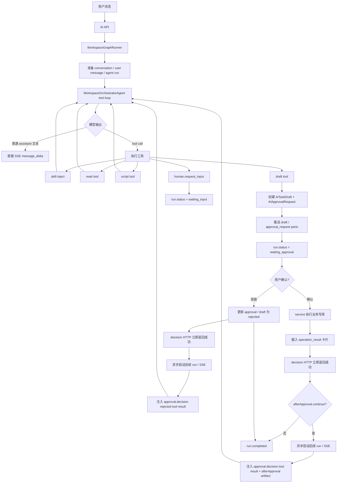

# AI 助手纯 Tool Calling 架构改造设计

更新时间：2026-06-24

## 1. 结论

可以把 AI 工作台改成纯 tool calling 架构，而且这是当前复杂度继续上升后的更合理方向。

目标架构中，模型只允许两类输出：

```text
1. 普通 assistant 文本
2. tool call
```

需要删除的旧协议：

```text
<visible_text>...</visible_text>
<structured_result>...</structured_result>
response_schema 驱动的 Orchestrator 最终 JSON
模型通过 state_patch 写 resumeAfterApproval
模型通过 structured_result.injectSkills 注入 Skill
```

保留的业务安全边界：

```text
模型可以读数据、运行脚本、生成 draft
模型不能直接写正式业务表
正式写入仍然必须 draft -> approval -> commit
approval commit 仍然由后端 service 程序化执行
```

最终体验：

```text
AI: 我先整理第一份菜谱草稿。
tool: recipe.create_draft
系统: 展示确认卡片
用户: 确认
系统: 展示已创建菜谱结果卡片
AI: 已创建白切鸡。接下来我继续整理下一份菜谱草稿。
tool: recipe.create_draft
系统: 展示下一张确认卡片
```

## 2. 当前问题

当前实现是三套机制叠加：

```text
provider tool calling
  + <visible_text> 用户可见文本协议
  + <structured_result> 最终状态 JSON 协议
```

这导致几个结构性问题。

### 2.1 用户可见文本是软协议

现在普通文本需要模型包在 `<visible_text>` 里，后端用 `VisibleTextStream` 抽取。

如果模型没有按格式输出，或者直接调用 draft tool，就会出现：

```text
用户确认上一个 draft
  -> Orchestrator 恢复
  -> 模型直接调用下一个 draft tool
  -> 后端立刻创建下一个 approval
  -> 用户看到确认卡片，但中间没有 AI 承接文本
```

第一阶段不新增代码级拦截，先把协议简化为普通文本和 tool call，并通过 Orchestrator prompt 要求模型在 draft tool 前先说明下一步。后续只有在该问题高频复现时，再单独评估是否需要更强工具调用约束。

### 2.2 状态来源不唯一

现在 run 的下一步来自多个地方：

```text
structured_result.status
structured_result.state_patch.resumeAfterApproval
structured_result.injectSkills
数据库里的 pending approval
conversation.context.taskState
run_artifacts
```

状态来源越多，越容易出现顺序、恢复和文案不一致。

### 2.3 模型最终 JSON 承担了不该承担的工作

模型最终 JSON 现在负责：

```text
注入 Skill
决定 status
写 state_patch
写 resumeAfterApproval
返回 cards
返回 context_summary
```

这些事情更适合拆成工具调用和程序状态：

```text
注入 Skill -> skill.inject tool
是否等待 approval -> 查 DB pending approval
是否继续 -> draft tool args.afterApproval
是否等待用户输入 -> human.request_input tool
结果卡片 -> 后端 service 根据业务结果生成
```

## 3. 目标架构

### 3.1 总体流程



### 3.2 模型输出规则

模型输出只有两种合法形态。

第一种是普通文本：

```text
我先根据图片整理第一份菜谱草稿。
```

第二种是 tool call：

```json
{
  "name": "recipe.create_draft",
  "arguments": {
    "draft": {
      "draftType": "recipe",
      "title": "白切鸡"
    },
    "afterApproval": {
      "continue": true,
      "instruction": "确认这份菜谱后，继续整理图片里的下一份菜谱草稿。",
      "nextDraftType": "recipe"
    }
  }
}
```

不再允许模型输出：

```text
<visible_text>...</visible_text>
<structured_result>...</structured_result>
```

也不再要求模型最终返回 JSON。

### 3.3 状态判断规则

run 状态由程序判断，不由模型 JSON 判断。

| 条件 | 状态 |
| --- | --- |
| 存在 pending approval | `waiting_approval` |
| 存在 pending human input | `waiting_input` |
| draft tool 成功发布 approval | `waiting_approval` |
| human.request_input 成功创建请求 | `waiting_input` |
| 模型停止调用工具并输出普通文本 | `completed` |
| 模型停止调用工具且无文本 | `completed`，不补系统总结 |
| 工具异常且不可恢复 | `failed` |
| 用户取消 run | `cancelled` |
| approval 确认后存在 `afterApproval.continue=true` | `running`，回到 Orchestrator |

## 4. Tool 体系设计

### 4.1 工具分类

保留现有 side effect 分类：

```text
read: 读取家庭范围内业务数据
draft: 校验并生成待确认草稿
write: 正式写入能力，不暴露给模型
```

新增 `control` side effect。控制类工具仍然是模型可调用 tool，但不直接写正式业务表。

目标枚举：

```python
ToolSideEffect = Literal["read", "draft", "write", "control"]
```

| 工具 | side effect | 作用 |
| --- | --- | --- |
| `skill.inject` | control | 注入一个或多个 Skill，替代 `structured_result.injectSkills` |
| `human.request_input` | control | 请求用户补充信息，进入 `waiting_input` |

第一阶段不引入 `task.remember`、`task.complete` 这类额外控制工具，也不在 prompt、tool registry、测试 fake provider 中预留它们。

原因：

```text
task.remember 会重新引入独立任务状态来源
task.complete 会让模型显式决定 run 状态
这两者都会削弱“程序根据 tool/runtime 状态收口”的目标
```

结束规则保持简单：

```text
模型没有 tool call 并输出普通文本 -> completed
模型没有 tool call 且无文本 -> completed
run 的完成状态由 provider loop / Runner 状态收口，不交给模型通过 task.complete 显式声明
```

### 4.2 `skill.inject`

用途：

```text
模型根据 catalog 判断需要某个能力时调用。
```

输入：

```json
{
  "skills": ["recipe_draft", "shopping_list"],
  "reason": "需要根据图片生成菜谱草稿，并在确认后继续整理购物清单。"
}
```

输出：

```json
{
  "injectedSkills": [
    {
      "key": "recipe_draft",
      "displayName": "菜谱整理",
      "allowedTools": ["recipe.create_draft"],
      "scriptTools": ["script.lint_recipe_draft"]
    }
  ]
}
```

执行规则：

```text
未注入业务 Skill 前，只暴露基础工具和 skill.inject
调用 skill.inject 后，Orchestrator 更新 active_skill_keys
同一个 provider tool loop 的下一次模型 round 立即暴露该 Skill 的 read/script/draft tools
skill.inject 只允许增加 Skill，不负责卸载或切换 Skill
重复注入已启用 Skill 时返回 already_injected
```

### 4.3 draft tool envelope

所有 draft tool 统一支持 envelope：

```json
{
  "draft": {},
  "afterApproval": {
    "continue": false,
    "instruction": "",
    "nextDraftType": "",
    "taskState": {}
  }
}
```

字段说明：

| 字段 | 必填 | 说明 |
| --- | --- | --- |
| `draft` | 是 | 原有业务草稿 payload |
| `afterApproval.continue` | 否 | 用户确认后是否继续同一个 run |
| `afterApproval.instruction` | 否 | 确认后交给 Orchestrator 的下一步指令 |
| `afterApproval.nextDraftType` | 否 | 下一步大概率要生成的草稿类型 |
| `afterApproval.taskState` | 否 | 复杂任务的轻量状态，比如已完成第几个菜谱 |

示例：

```json
{
  "draft": {
    "draftType": "recipe",
    "schemaVersion": "recipe.v1",
    "title": "白切鸡",
    "servings": 3
  },
  "afterApproval": {
    "continue": true,
    "instruction": "确认白切鸡后，继续根据图片整理下一份菜谱草稿。",
    "nextDraftType": "recipe",
    "taskState": {
      "source": "uploaded_image",
      "completedRecipeNames": ["白切鸡"],
      "remainingHint": "图片里还有榨菜咸肉烧丝瓜、板栗烧鸡、干锅花菜等菜谱"
    }
  }
}
```

### 4.4 `human.request_input`

继续作为工具调用使用。它不代表 approval，不写正式业务表。

调用后：

```text
Runner 创建 pending human input
run.status = waiting_input
用户回复后，Runner 把 human.input_result 作为工具结果交回 Orchestrator
```

## 5. Provider Runtime 改造

### 5.1 删除参数

`BaseChatProvider.generate_with_tools()` 删除：

```python
response_schema: dict[str, Any] | None = None
visible_text_handler: VisibleTextHandler | None = None
```

目标签名：

```python
def generate_with_tools(
    self,
    *,
    system: str,
    user: ProviderUserContent,
    tools: Callable[[], list[ToolDefinition]],
    tool_handler: ToolCallHandler,
    message_handler: AssistantMessageHandler | None = None,
    max_rounds: int = 8,
) -> ToolLoopResult:
    ...
```

新增 `message_handler`，专门接收模型普通文本。`tools` 使用 callable 是硬约束，不是性能优化点：provider 每个 model round 前必须调用它获取最新工具集合，避免 `skill.inject` 后仍沿用 run 开始时的一次性 tool binding。

```python
AssistantMessageHandler = Callable[[str], None]
ToolProvider = Callable[[], list[ToolDefinition]]
```

`ToolLoopResult` 建议替代 `ChatProviderResult` 在 tool loop 场景中的职责：

```python
@dataclass(slots=True)
class ToolLoopResult:
    text: str | None
    status: Literal["completed", "failed", "cancelled"]
    model: str
    tool_calls: list[dict[str, Any]]
    assistant_message_count: int = 0
    error: str | None = None
```

如果短期继续复用 `ChatProviderResult` 这个 dataclass 名称，也必须删除 `structured_mode` 和 tool loop 中的 `response_schema` 语义；名称复用不能保留旧结构化输出路径。

### 5.2 文本流式规则

provider 在 stream 中收到 assistant 普通文本 chunk 时：

```text
1. 追加到当前 assistant text buffer
2. 调用 message_handler(delta)
3. Runner 将 delta 写入 live stream cache 和 message_delta SSE
```

不再解析 `<visible_text>`。

如果同一个 assistant message 同时包含文本和 tool call：

```text
先流式发送文本
再执行 tool call
```

这正好满足主流 agent 体验：

```text
AI 先说明
再调用工具
```

### 5.3 工具调用规则

provider tool loop 保持标准流程：

```text
messages = [system, user]
while round < max_rounds:
  current_tools = tools()
  bind current_tools for this round
  assistant_message = model(messages, current_tools)
  stream assistant text
  if assistant_message has no tool_calls:
    return completed
  append assistant_message
  for each tool_call:
    result = tool_handler(name, args)
    append ToolMessage(result)
```

不同点：

```text
不再把 response_schema 拼到 system prompt
不再期待最终 JSON
不再用 XML-like tag 区分文本
```

## 6. Orchestrator 改造

### 6.1 删除最终结构化解析

删除或废弃：

```text
ORCHESTRATOR_RESULT_SCHEMA
_response_schema()
_parse_result()
_structured_result_schema_error()
_skill_result_from_parsed()
VisibleTextStream
VISIBLE_TEXT_OPEN / VISIBLE_TEXT_CLOSE
STRUCTURED_RESULT_OPEN / STRUCTURED_RESULT_CLOSE
```

Orchestrator 不再把模型最终文本解析成 JSON。

### 6.2 新的 `run()` 语义

`WorkspaceOrchestratorAgent.run()` 仍然保留，但只负责：

```text
准备 system prompt
准备 user payload
准备可用 tools
运行 provider.generate_with_tools()
记录工具调用
返回程序组装的 SkillResult
```

伪代码：

```python
def run(context, injected_skill_keys):
    active_skill_keys = injected_skill_keys
    tool_loop = ProviderToolLoop(...)

    result = provider.generate_with_tools(
        system=build_system_prompt(active_skill_keys),
        user=build_user_payload(context),
        tools=available_tools(active_skill_keys),
        tool_handler=call_tool,
        message_handler=stream_assistant_delta,
    )

    return SkillResult(
        text=result.text or live_message_text,
        status=derive_status_from_runtime(),
        drafts=draft_outputs,
        tool_calls=tool_records,
        context_summary=program_context_summary,
    )
```

### 6.3 `skill.inject` 替代 structured result 注入

当前：

```json
{
  "action": "continue",
  "injectSkills": ["recipe_draft"]
}
```

目标：

```json
tool_call: skill.inject
arguments:
{
  "skills": ["recipe_draft"],
  "reason": "需要根据图片生成菜谱草稿"
}
```

`skill.inject` 的 tool handler 做三件事：

```text
1. 校验 skill key 是否存在
2. 更新 active_skill_keys 和 injection_history
3. 返回新暴露的工具列表摘要
```

`skill.inject` 采用纯动态模式：不结束 Orchestrator，不返回 `running` 让 Runner 重进一轮，而是在同一个 provider tool loop 内刷新工具集合。

执行规则：

```text
1. provider loop 每次调用模型前，都根据 active_skill_keys 重建 tools。
2. control tools 永远可用，例如 skill.inject、human.request_input。
3. skill.inject 成功后只更新内存中的 active_skill_keys 和 injection_history。
4. provider 把 skill.inject 的 ToolMessage 返回给模型。
5. 下一次模型 round 立刻看到新 Skill 暴露的 read/script/draft tools。
6. 已注入的 Skill 重复注入时返回 already_injected，不改变状态。
7. 同一个 run 限制最多注入 4 个业务 Skill，避免工具集合过大。
```

实现硬约束：

```text
provider 不能在 run 开始时 bind 一次 tools 后复用到底
每个 model round 都必须使用最新 active_skill_keys 构建 tool schema
如果底层 SDK 需要 bind_tools，则 bind_tools 必须发生在每个 round 内
ToolMessage 历史继续保留，工具集合变化只影响下一次模型可见工具列表
```

如果模型请求了当前 round 未暴露的工具：

```text
tool handler 必须返回 unavailable_tool / unauthorized_tool
不能因为模型传了 tool name 就绕过 active_skill_keys 白名单
不能自动注入对应 Skill 后继续执行该工具
```

伪代码：

```python
active_skill_keys = list(initial_skill_keys)

for round_index in range(max_rounds):
    tools = build_tools(active_skill_keys)
    client = provider.bind_tools(tools)
    assistant = client.next_message(messages)
    stream_assistant_text(assistant.content)

    if not assistant.tool_calls:
        return completed

    for call in assistant.tool_calls:
        if call.name == "skill.inject":
            result = inject_skills(call.args, active_skill_keys)
            messages.append(tool_message(call.id, result))
            continue

        result = call_scoped_tool(call.name, call.args, active_skill_keys)
        messages.append(tool_message(call.id, result))
```

### 6.4 draft 前说明规则

为了避免“确认后不说话就生成下一个 draft”，第一阶段只保留 prompt 和工具使用约定，不增加专门的代码级拦截分支。

规则：

```text
调用 draft tool 前，模型应先输出普通文本，说明接下来要生成什么草稿以及为什么。
```

第一阶段不做额外兜底：

```text
不新增 draft_requires_intro_text
不拦截 draft tool
不让模型为了补说明重试一遍 draft tool
```

如果实际运行仍频繁出现“无说明直接 draft”，再评估是否引入更强约束。优先保持主链路简单。

### 6.5 draft 后停止可见文本

draft tool 成功后：

```text
立即创建 draft / approval
run.status = waiting_approval
停止继续处理本次 provider loop
丢弃 draft tool 成功后的 assistant 后续文本
```

原因：

```text
确认卡片出现后，卡片本身就是下一步交互
不需要模型再说“已生成，请确认”
```

## 7. Runner 改造

### 7.1 保留职责

`WorkspaceGraphRunner` 继续负责：

```text
创建 run
创建 user message
调用 Orchestrator
持久化 assistant message
处理 waiting_approval / waiting_input
处理 approval commit
推送 SSE
维护 live stream cache
最终组装 AIChatResponse
```

### 7.2 删除结构化状态

从 `WorkspaceGraphState` 中删除或停止使用：

```text
last_structured_result
```

从 conversation context 中删除或停止使用：

```text
taskState.resumeAfterApproval
```

替代：

```text
run_artifacts 中的 draft_after_approval
approval decision result 中的 afterApproval
```

### 7.3 approval 确认后继续

当前：

```text
Orchestrator 写 state_patch.resumeAfterApproval
Runner 存到 conversation.context.taskState
用户确认后 Runner 消费 taskState.resumeAfterApproval
```

目标：

```text
draft tool args.afterApproval 存到 AITaskDraft 或 approval metadata
用户确认后 service 返回 decision_result
Runner 从 draft/approval metadata 取 afterApproval
如果 continue=true，写入 run_artifacts
回到 Orchestrator
```

建议 artifact：

```json
{
  "id": "after_approval:agent_run-xxx:ai_approval-xxx",
  "type": "draft_after_approval",
  "kind": "task_resume",
  "version": 1,
  "status": "pending",
  "payload": {
    "instruction": "确认白切鸡后，继续整理图片里的下一份菜谱草稿。",
    "nextDraftType": "recipe",
    "taskState": {
      "completedRecipeNames": ["白切鸡"]
    }
  }
}
```

Orchestrator user payload 中提供：

```json
{
  "currentRunArtifacts": [
    {
      "type": "approval_decision",
      "payload": {
        "approval": {},
        "draft": {},
        "operation": {},
        "business_entity": {}
      }
    },
    {
      "type": "draft_after_approval",
      "payload": {
        "instruction": "继续整理图片里的下一份菜谱草稿。"
      }
    }
  ]
}
```

模型看到后输出普通文本：

```text
已创建白切鸡。接下来我继续整理下一份菜谱草稿。
```

然后调用下一个 draft tool。

### 7.4 result card 仍然程序生成

`operation_result` 卡片不交给模型。

```text
approval commit service 写库成功
  -> build_approval_result_card()
  -> append_message_result_card()
  -> 插到对应 approval_request 后
```

这保证正式写入结果可信，不依赖模型复述。

### 7.5 approval decision API 必须快速返回

用户点击确认或拒绝后，HTTP decision 接口只负责完成程序化审批动作，不等待后续 AI 输出。

这是接口级硬边界：

```text
POST /api/ai/conversations/{conversation_id}/approvals/{approval_id}/decision
  只做 commit / reject、状态更新、operation_result 持久化和必要的 continuation trigger 记录
  成功写库后立即返回 2xx
  不调用 Orchestrator
  不打开 provider stream
  不等待下一段 assistant 文本
  不等待下一个 draft tool
```

如果需要继续复杂任务，继续动作必须由另一个异步流程消费：

```text
1. decision HTTP 返回成功和最新 message/run 快照。
2. 前端解除按钮 submitting，并立即展示 operation_result。
3. 前端通过既有 SSE continuation endpoint、run polling，或后端后台调度接收后续 Orchestrator 输出。
4. 后续 Orchestrator 的成功或失败只影响后续 assistant message / run 状态，不改变本次 approval decision 的成功结果。
```

确认路径的同步事务边界：

```text
1. 校验 approval 仍然 pending，且属于当前 family / conversation / run。
2. 调用 services/ai_operations 执行业务 commit。
3. 在同一事务内更新 approval / draft 状态。
4. 生成并持久化 operation_result message part，插到对应 approval_request 后。
5. 如果 afterApproval.continue=true，创建 draft_after_approval artifact 或 continuation trigger。
6. 提交事务。
7. HTTP 立即返回提交成功和最新 message/run 快照。
```

不允许：

```text
decision HTTP 请求等待 Orchestrator 继续输出
decision HTTP 请求等待下一个 draft 生成
decision HTTP 请求把“后续 AI 成功”当作本次确认成功条件
decision HTTP 请求在 commit 成功后因为后续 AI 失败而返回 409 / 5xx
```

后续 AI 继续必须异步发生：

```text
decision 成功返回后，前端通过现有 SSE / run polling 接收后续 assistant text、run_activity 和 draft/approval parts
如果后续 Orchestrator 失败，只影响后续回复，不回滚已经成功提交的 approval commit
如果后续异步 run 无法启动，用户仍应看到 approval 已确认和 operation_result；失败只作为后续 run 错误暴露
```

这条边界用来保证：

```text
确认按钮不会长时间处于 submitting
写库成功后用户立刻看到 operation_result
AI 后续慢或失败时，不影响用户刚才的确认动作
```

## 8. 数据模型与持久化

### 8.1 AITaskDraft 增加 metadata

如果现有 `AITaskDraft` 没有可用 metadata 字段，需要新增字段。

建议：

```text
AITaskDraft.ai_metadata JSON nullable
```

保存：

```json
{
  "toolName": "recipe.create_draft",
  "afterApproval": {
    "continue": true,
    "instruction": "确认后继续整理下一份菜谱。",
    "nextDraftType": "recipe",
    "taskState": {}
  }
}
```

持久化边界：

```text
afterApproval 是 agent continuation metadata
不能混进 recipe / shopping_list / meal_plan 等业务 draft payload
不能进入 normalized draft payload 或 commit payload
不能作为前端可编辑字段暴露
不能由 approval commit service 当作业务写入字段消费
不能出现在 AiTaskDraftDTO / AiApprovalRequestDTO / message part data 中
只能由 Runner / Orchestrator continuation 读取
```

如果已有可用内部 JSON 字段，可以复用，不要新增。复用字段时必须保证 serializer 不把 `afterApproval` 透传到对外 DTO。

如果没有现成的内部 JSON 字段，新增 migration 是必要成本，不允许为了省迁移把 `afterApproval` 塞进业务 draft payload。

### 8.2 AIApprovalRequest metadata

也可以放在 approval metadata，但更推荐放 draft metadata：

```text
afterApproval 描述的是 draft 被确认后的任务延续
与 draft 关系更强
approval 只是用户对 draft 的一次确认请求
```

### 8.3 迁移

如果新增字段，需要 Alembic migration：

```text
backend/alembic/versions/<rev>_add_ai_task_draft_metadata.py
```

同时更新：

```text
backend/app/models/domain.py
backend/app/schemas/ai.py 仅在内部 schema 需要时更新；对外 DTO 默认不暴露 afterApproval
backend/app/services/serializers.py
backend/tests/ai_infra/*
```

对外 DTO 第一阶段不暴露 `afterApproval`。前端只看到正常的 draft、approval_request、operation_result parts。

## 9. SSE 与前端协议

### 9.1 SSE 事件名保持

可以继续使用现有事件：

```text
message_delta
message_part
run_activity
response
```

变化是 `message_delta` 来源：

当前：

```text
模型输出 <visible_text> 中的内容
```

目标：

```text
模型普通 assistant text chunk
```

前端无需知道 `<visible_text>`。

### 9.2 message parts 顺序

目标顺序：

```text
assistant text
run_activity
draft
approval_request
operation_result
assistant text
run_activity
draft
approval_request
```

关键规则：

```text
text delta append 到 live message parts
tool activity append 到 live message parts
draft/approval append 到 live message parts
result_card append 到 matching approval_request 后
final response 按 part id 去重合并
```

### 9.3 前端影响

前端主要影响：

```text
不需要处理 <visible_text> 或 <structured_result>
继续展示 message_delta / message_part
approval gating 逻辑不变
result_card 展示逻辑不变
```

如果前端当前测试依赖 `<visible_text>` 或 provider fake 输出，需要同步更新。

## 10. Prompt 设计

### 10.1 Orchestrator system prompt

删除：

```text
最终回复必须包含 <visible_text>...
随后输出 <structured_result>...
structured_result 只放裸 JSON
```

替换为：

```text
你是 Culina AI 工作台的主 Orchestrator。
你可以输出普通文本，也可以调用工具。
普通文本会直接展示给用户。
调用草稿工具前，必须先用普通文本说明接下来要生成什么草稿以及为什么。
调用草稿工具后，当前 run 会暂停等待用户确认，不要再输出“已生成，请确认”。
如果需要新的能力，调用 skill.inject。
如果信息不足，调用 human.request_input。
如果需要创建或修改正式业务数据，调用对应 draft tool；不要声称已经写入正式数据。
正式写入由用户确认后系统完成。
```

### 10.2 user payload

继续提供：

```json
{
  "currentMessage": "...",
  "currentAttachments": [],
  "quickTask": "recipe_draft",
  "conversation": [],
  "currentRunArtifacts": [],
  "injectedSkills": [],
  "allowedTools": []
}
```

删除：

```text
allowedCardTypes
allowedDraftTypes 的最终 JSON 校验语义
previousStructuredResultError
```

可以保留 `allowedDraftTypes` 作为提示信息，但不用于最终 JSON 校验。

## 11. 关键场景流程

### 11.1 简单问答

```text
用户: 怎么保存剩菜？
AI 普通文本: 建议冷却后密封冷藏...
无 tool call
Runner: completed
```

### 11.2 只读分析

```text
用户: 看看我家库存有什么快过期
AI: 我先看一下库存。
tool: inventory.read_available_items
AI: 这几样需要优先处理...
Runner: completed
```

### 11.3 单 draft

```text
用户: 帮我创建番茄鸡蛋面菜谱
AI: 我先整理一份番茄鸡蛋面菜谱草稿。
tool: recipe.create_draft({ draft, afterApproval: { continue: false } })
Runner: 创建 draft / approval
Runner: waiting_approval
用户确认
service: 创建 Recipe
Runner: 插入 operation_result
Runner: completed
```

### 11.4 多 draft

```text
用户: 图片里有 6 个菜谱，都帮我创建

AI: 我先整理第一份白切鸡菜谱草稿。
tool: recipe.create_draft({
  draft: 白切鸡,
  afterApproval: {
    continue: true,
    instruction: "继续整理图片里的下一份菜谱草稿。",
    taskState: { completedRecipeNames: ["白切鸡"] }
  }
})
Runner: waiting_approval

用户确认
service: 创建白切鸡
Runner: operation_result
Runner: 回到 Orchestrator

AI: 已创建白切鸡。接下来我继续整理下一份菜谱草稿。
tool: recipe.create_draft(...)
Runner: waiting_approval
```

### 11.5 信息不足

```text
用户: 帮我安排下周晚餐
AI: 我需要先确认安排几天，以及是否只安排晚餐。
tool: human.request_input(...)
Runner: waiting_input
用户回答
Runner: 注入 human.input_result
AI: 好的，我按 5 天晚餐来安排。
tool: meal_plan.create_draft(...)
```

## 12. 改造阶段

### 阶段 1：Provider 纯文本流式化

目标：

```text
assistant 普通文本直接作为 message_delta
删除 VisibleTextStream 在 Orchestrator 主路径中的使用
不再要求 <visible_text>
```

修改文件：

```text
backend/app/ai/runtime/provider.py
backend/app/ai/workflows/orchestrator.py
backend/tests/ai_infra/test_workspace_streaming.py
backend/tests/ai_infra/test_foundation.py
```

验收：

```text
模型普通文本能直接流式展示
模型文本后调用 tool 时，文本先于 run_activity 和 approval 卡片出现
不包含 <visible_text>
```

### 阶段 2：删除 structured_result

目标：

```text
Orchestrator 不再解析模型最终 JSON
删除 response_schema
删除 structured_result schema retry
```

替代状态：

```text
pending approval -> waiting_approval
pending human input -> waiting_input
assistant stop without tool call -> completed
tool failure -> failed
```

修改文件：

```text
backend/app/ai/workflows/orchestrator.py
backend/app/ai/workflows/runner.py
backend/app/ai/workflows/state.py
backend/app/ai/skills/toolcall.py
backend/app/ai/runtime/provider.py
```

验收：

```text
全量 AI infra fake provider 不再输出 <structured_result>
不再有 previousStructuredResultError
不再有 response_schema 参数
```

### 阶段 3：工具化 Skill 注入

目标：

```text
新增 skill.inject tool
删除 structured_result.injectSkills
```

实现方式：

```text
provider loop 每次模型 round 前按 active_skill_keys 重建 tools
skill.inject 调用后立即更新 active_skill_keys
同一个 provider loop 的下一次模型 round 暴露新 Skill tools
不通过 Runner 返回 running 重进 Orchestrator
```

修改文件：

```text
backend/app/ai/tools/catalog/workspace.py 或新增 control.py
backend/app/ai/workflows/orchestrator.py
backend/app/ai/skills/registry.py
backend/app/ai/runtime/provider.py
backend/tests/ai_infra/test_foundation.py
```

验收：

```text
未注入 Skill 前不能调用业务 draft tool
调用 skill.inject 后，同一个 provider loop 内下一次模型 round 可以调用对应工具
provider 每个 round 都使用最新 active_skill_keys 重建 / bind tools
测试 fake provider 也必须通过 tools() 获取当前 round 工具集合，不能缓存初始 tools
模型调用未暴露业务工具时返回 unavailable_tool / unauthorized_tool
重复注入已启用 Skill 返回 already_injected
injection_history 正确记录
```

### 阶段 4：afterApproval envelope

目标：

```text
draft tool 参数支持 afterApproval
删除 state_patch.resumeAfterApproval
```

修改文件：

```text
backend/app/ai/tools/catalog/*
backend/app/ai/workflows/orchestrator.py
backend/app/ai/workflows/runner.py
backend/app/api/ai.py 或 approval decision 对应 route
backend/app/services/ai_operations/drafts.py
backend/app/services/ai_operations/approvals.py
backend/app/models/domain.py
backend/alembic/versions/*
```

验收：

```text
draft 创建后 afterApproval 被持久化
确认后 Runner 能恢复 afterApproval
approval decision 写库和 result_card 持久化成功后立即返回
approval decision 不等待后续 Orchestrator 输出或下一个 draft
确认后 Orchestrator 能继续下一步
拒绝后不写入正式业务数据，但 approval.decision rejected 会回到 Orchestrator，由 AI 判断是否结束、调整重做或继续下一项
```

### 阶段 5：删除旧协议残留

目标：

```text
删除 VisibleTextStream
删除 VISIBLE_TEXT_OPEN / VISIBLE_TEXT_CLOSE
删除 STRUCTURED_RESULT_OPEN / STRUCTURED_RESULT_CLOSE
删除 last_structured_result
删除相关文档旧描述
```

搜索命令：

```bash
rg -n "visible_text|structured_result|VisibleTextStream|last_structured_result|response_schema" backend docs frontend
```

验收：

```text
除历史迁移说明外，主路径没有旧协议引用
```

## 13. 测试计划

### 13.1 后端测试

新增或更新：

```text
backend/tests/ai_infra/test_workspace_streaming.py
backend/tests/ai_infra/test_workspace_approvals.py
backend/tests/ai_infra/test_foundation.py
```

必须覆盖：

```text
普通 assistant 文本直接产生 message_delta
普通文本后调用 read tool，顺序正确
普通文本后调用 draft tool，approval 卡片紧随 tool activity
draft tool 成功后丢弃后续“已生成请确认”类文本
用户确认后 result_card 紧跟 approval_request
approval decision 接口在 commit + result_card 成功后返回，不等待后续 Orchestrator
approval decision 成功后即使后续 Orchestrator 失败，也不能让本次 HTTP decision 变成失败
approval decision HTTP 不重复提交 approval，后续 SSE continuation 只能消费已记录的 decision result / artifact
afterApproval.continue=true 时回到 Orchestrator
确认后下一轮文本由 Orchestrator 普通文本输出，不走 stream_generate follow-up
多 draft 任务每次只生成一个 pending approval
拒绝 approval 时不盲目执行 afterApproval；拒绝结果交给 Orchestrator 判断是否继续
human.request_input 进入 waiting_input，用户回复后继续
skill.inject 后下一轮工具集合变化
skill.inject 后 provider 下一轮使用新工具集合，不能复用 run 开始时的一次性 bind_tools
provider / fake provider 每个 model round 前都会重新调用 tools()，skill.inject 后工具集合变化在同一个 loop 内可见
未注入 Skill 时模型请求业务工具会返回 unavailable_tool / unauthorized_tool
```

推荐命令：

```bash
backend/.venv/bin/python -m pytest backend/tests/ai_infra/test_workspace_streaming.py -q
backend/.venv/bin/python -m pytest backend/tests/ai_infra/test_workspace_approvals.py -q
backend/.venv/bin/python -m pytest backend/tests/ai_infra/test_foundation.py -q
backend/.venv/bin/python -m pytest backend/tests/ai_infra -q
```

### 13.2 前端测试

前端应重点验证 SSE 合并和展示，不关心旧标签。

更新：

```text
frontend/src/components/ai/AiWorkspace.test.tsx
frontend/src/api/aiApi.test.ts
```

覆盖：

```text
message_delta 普通文本正常展示
run_activity 位于 draft/approval 前
approval_request 到达后卡片展示
result_card 紧跟对应 approval
final response 合并不丢 live text
无 <visible_text> / <structured_result> 文本泄漏
```

推荐命令：

```bash
npm --prefix frontend run test -- AiWorkspace.test.tsx aiApi.test.ts
npm --prefix frontend run build
```

## 14. 风险与处理

### 14.1 模型直接调用 draft tool

风险：

```text
没有说明就弹出确认卡片
```

处理：

```text
第一阶段只通过 prompt 约束模型先说明再调用 draft tool
不新增 draft_requires_intro_text 或二次重试分支
如果线上仍高频出现，再单独评估是否需要更强工具调用约束
```

### 14.2 模型不调用 skill.inject 就调用业务工具

风险：

```text
越权工具调用
```

处理：

```text
工具集合按 active_skill_keys 暴露
未暴露工具即使模型请求也拒绝
```

### 14.3 afterApproval 丢失

风险：

```text
复杂任务确认后不能继续
```

处理：

```text
afterApproval 跟 draft 一起持久化
approval commit 后从 draft metadata 恢复
测试覆盖 DB 中断和重新 resume
```

### 14.4 模型停止时没有文本

风险：

```text
run completed 但用户没有看到总结
```

处理：

```text
第一阶段不做补话兜底。
模型停止调用工具且没有普通文本时，Runner 按 completed 收口，不生成保守系统文本，也不额外再跑一轮总结。
如果后续产品上需要“每次必须有收尾话”，再作为独立体验需求设计。
```

### 14.5 Provider 不支持流式 tool text

风险：

```text
部分 OpenAI-compatible provider 在 tool call streaming 中不稳定
```

处理：

```text
第一阶段不设计复杂 fallback 分支。
如果 provider 只能返回完整 assistant message，就把完整 assistant message.content 作为一次 message_delta 发送。
如果 provider 调用失败，直接返回 failed。
不恢复 <visible_text>
```

## 15. 删除清单

最终应删除或停止使用：

```text
backend/app/ai/skills/toolcall.py 中的 VisibleTextStream
VISIBLE_TEXT_OPEN
VISIBLE_TEXT_CLOSE
STRUCTURED_RESULT_OPEN
STRUCTURED_RESULT_CLOSE
backend/app/ai/workflows/orchestrator.py 中的 ORCHESTRATOR_RESULT_SCHEMA
_response_schema()
_parse_result()
_structured_result_schema_error()
previousStructuredResultError
last_structured_result
state_patch.resumeAfterApproval
conversation.context.taskState.resumeAfterApproval
response_schema 参数在 tool loop 主路径中的使用
```

不保留旧 `ToolCallingSkill` 运行时命名。Skill catalog 统一使用动态 `CatalogSkill` / manifest bundle 表达能力包，避免实现和文档继续暗示旧 toolcall skill 路径存在。

## 16. 落地顺序建议

推荐按下面顺序做，避免一次性大爆炸：

```text
1. Provider 普通文本直接流式输出，去掉 VisibleTextStream 依赖
2. 新增 skill.inject tool，替代 injectSkills
3. draft tool 支持 afterApproval envelope
4. Runner approval resume 改读 draft afterApproval
5. 删除 structured_result 解析和 schema retry
6. 清理旧字段、旧文档和测试 fixture
```

每一步都要保证：

```text
AI 不能直接写正式业务数据
draft 必须来自 draft tool
approval commit 必须由 service 执行
pending approval 期间不能继续生成下一个 draft
```

## 17. 最终目标检查表

完成后，用这张表验收：

| 检查项 | 目标 |
| --- | --- |
| 模型可见文本 | 普通 assistant content 直接展示 |
| 工具调用 | 只使用 provider tool call |
| Skill 注入 | `skill.inject` tool |
| draft 生成 | draft tool |
| draft 前说明 | prompt 约定模型先说话再调用 draft tool |
| draft 后暂停 | Runner 进入 `waiting_approval` |
| approval commit | service 程序写库 |
| result card | 程序生成并插到 approval 后 |
| 确认后继续 | draft `afterApproval` artifact |
| 复杂任务 | 一个 draft 一个 approval，确认后继续 |
| `<visible_text>` | 主路径不存在 |
| `<structured_result>` | 主路径不存在 |
| response schema | tool loop 主路径不存在 |
