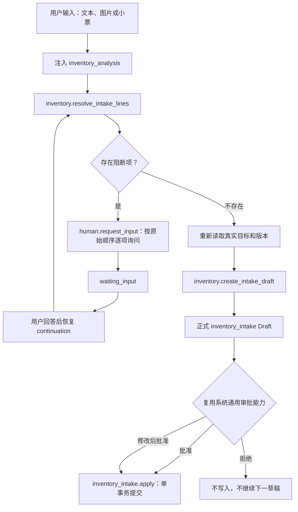

# AI 统一入库草稿与 Skill 边界优化设计

日期：2026-07-21

## 1. 背景

Culina 当前存在两条相互割裂的 AI 入库路径：

- `inventory_analysis` 通过 `inventory.preview_intake_candidates` 输出终态的 `inventory_intake_candidates` 卡片；
- `shopping_list` 通过 `shopping.preview_intake_candidates` 匹配采购项，再创建 `shopping_intake` 草稿。

第一条路径中的候选卡不是正式 Draft：前端只用本地状态保存勾选结果。用户点击“按选中项准备入库”后，前端再伪造一条新的用户消息启动下一次 run。结果是入库绕开了系统已有的 Draft 与审批能力，形成了一套独立的候选和二次发起机制。

真实测试进一步暴露了这套分叉设计的问题。家庭待买项包含鸡蛋和三文鱼，小票包含牛奶、鸡蛋、三文鱼和垃圾袋时：

- 三文鱼的“公斤”与现有 Ingredient 支持单位不一致，候选预览直接抛错，导致整批工具调用失败；
- 模型用普通文本询问三文鱼如何处理，却没有调用 `human.request_input`，因此 run 没有暂停；
- 模型在用户回答前删除三文鱼并重试，随后展示一张不包含三文鱼的入库候选卡；
- 垃圾袋在对话中被说成“已排除”，卡片里却显示“还需确认”；
- 牛奶虽然不在采购清单中，却与采购项使用同一套含糊的候选表达；
- 鸡蛋和三文鱼的购物完成、部分采购和库存写入没有在一份正式审批中统一表达。

这不是单个工具报错问题，而是 Skill 归属、解析合同和 Draft 类型同时不统一。本设计将所有库存增加收敛到 `inventory_analysis` 和正式 `inventory_intake` Draft，并删除旧候选卡与旧 `shopping_intake` AI 合同。

## 2. 目标

本设计实现以下产品和系统目标：

1. 所有库存增加都由 `inventory_analysis` 负责，不因物品来源不同而切换 Skill 或 Draft 类型。
2. 采购清单关联入库与额外购买直接入库可以出现在同一份 Draft 中。
3. 同一批入库只需要一次明确审批，购物状态和库存变化在一个事务中提交。
4. 目标歧义、单位不兼容、数量缺失和日期冲突在 Draft 之前通过 `human.request_input` 逐项解决。
5. 所有可执行入库都严格使用系统现有 Draft 与审批能力，不新增候选卡、本地审批状态、product-loop 或其他旁路机制。
6. 非库存对象可以被可靠忽略，不阻断 Draft，也不再以“还需确认”表达。
7. 额外购买在能唯一匹配现有 Ingredient 或 Food 时可以直接入库，不强制创建购物项。
8. 任一执行行失败时整批回滚；网络重试不会重复增加库存。
9. 彻底删除未上线的旧候选卡和 `shopping_intake` AI 兼容合同。

## 3. 非目标

本设计不包含：

- 修改通用 AI Orchestrator、Runner 或 tool-loop 重试机制；
- 修改全局工具错误或进度消息的展示策略；
- 新增独立的采购入库 Skill；
- 新增 `inventory_operation.adjust`；
- 设计“把鸡蛋库存改成 3 个”的库存校准能力；
- 修改现有 consume、dispose 的业务语义；
- 自动创建不存在的 Ingredient、Food 或购物项；
- 将一次性包装换算保存为 Ingredient 的长期单位规则；
- 新增数据库字段或 Alembic migration；
- 在现有底层能力不能保证原子撤销时承诺“一键撤销整批入库”。

本设计中的“彻底删除旧代码”针对 AI Skill、Tool、Draft、消息卡片及其前端合同。现有 `apply_shopping_intake()` 事务服务、购物入库 HTTP API、库存历史枚举或数据库值如果仍被非 AI 产品路径使用，可以作为底层实现继续保留；它们不能继续作为模型可见的 Skill、Draft 或 UI 概念。

## 4. Skill 能力边界

### 4.1 `shopping_list`

`shopping_list` 只负责采购前计划和清单维护：

- 查询 pending、completed 或全部购物项；
- 创建购物项；
- 修改名称、计划数量、单位、优先级和备注；
- 删除购物项；
- 恢复为待买；
- 根据低库存或菜谱缺料生成采购建议和购物草稿。

`shopping_list` 不再负责：

- 解析小票、采购文本或入库图片；
- 将购物项设置为新的 `done=true`；
- 部分采购；
- 完成购物项但不入库；
- 采购完成并入库；
- 创建任何入库 Draft。

如果用户在 `shopping_list` 上下文中说“这些买到了”“按小票入库”，应路由或注入 `inventory_analysis`，而不是继续使用购物清单草稿。

### 4.2 `inventory_analysis`

`inventory_analysis` 负责真实库存事实和变化：

- 查询可用、低库存、临期或其他库存信息；
- 手工单项或批量入库；
- 小票图片导入；
- 采购文本导入；
- 冰箱或储物照片整理入库；
- 朋友赠送、盘点发现、初始库存和历史补录；
- 采购项完成并入库；
- 部分采购；
- 完成采购项但不入库；
- 额外购买直接入库；
- consume 和 dispose。

稳定的 Skill 边界为：

```text
采购前计划和待办维护 → shopping_list
实际库存事实和库存变化 → inventory_analysis
```

## 5. 统一入库流程

所有入库来源使用同一条业务流程：



必须保持以下不变量：

- 有阻断项时不得创建半成品 Draft；
- 普通助手文本不能替代 `human.request_input`；
- `waiting_input` 时不能同时展示可提交候选卡；
- 解决一个阻断项后继续处理下一项，不能丢弃失败行后重试；
- 所有阻断项解决后只创建一份正式 Draft；
- 正式 Draft 必须交给系统现有 Draft 与审批能力处理，不得增加候选卡或自定义后续机制；
- 审批拒绝、stale、冲突或执行失败时不自动生成下一份 Draft。

## 6. 统一 Resolver

### 6.1 Tool 合同

新增模型可见 read Tool：

```text
inventory.resolve_intake_lines
```

它替代：

```text
inventory.preview_intake_candidates
shopping.preview_intake_candidates
```

输入只包含模型从用户文本、图片或当前会话中识别出的证据，不允许模型直接声明数据库匹配结果。建议输入结构：

```json
{
  "sourceType": "receipt_image",
  "sourceReference": {
    "mediaId": "media_xxx"
  },
  "purchaseIntent": "purchase",
  "dateEvidence": {
    "userDate": null,
    "receiptDate": "2026-07-21"
  },
  "lines": [
    {
      "sourceLineId": "line-1",
      "rawText": "鸡蛋 2个",
      "name": "鸡蛋",
      "quantity": "2",
      "unit": "个",
      "packageCount": null,
      "packageUnit": null,
      "confidence": 0.98
    }
  ]
}
```

模型不得在输入中伪造：

- shopping item ID；
- Ingredient、IngredientState 或 Food ID；
- row version；
- 当前库存数量；
- 当前购物项完成状态；
- 家庭归属。

Resolver 必须在当前 `family_id` 内读取并匹配真实对象，输出结构化业务分类：

```json
{
  "readyLines": [],
  "needsResolution": [],
  "missingTargets": [],
  "ignoredItems": [],
  "dateResolution": {},
  "summary": {}
}
```

### 6.2 匹配优先级

每行按以下优先级解析：

1. 当前会话或 typed continuation 中已经由用户明确确认的真实目标；
2. 当前家庭 pending ShoppingListItem；
3. 当前家庭 Ingredient；
4. 当前家庭 Food；
5. 进入目标歧义或缺失档案处理。

匹配不能只依赖名称字符串完全相等，应复用现有搜索和别名能力，但只有唯一、足够可靠的结果才能进入 `readyLines`。多个真实对象都合理时必须进入 `needsResolution`。

### 6.3 结果分类

`readyLines` 表示已经满足生成 Draft 的全部条件，包括：

- 真实目标唯一；
- 目标属于当前家庭；
- 数量和单位足够可靠；
- 单位符合目标合同，或存在已确认的一次性换算；
- 采购关联语义已经明确；
- 必要版本可以在 Draft 归一化时重新读取。

`needsResolution` 用于可以通过用户选择解决的问题：

- 多个购物项或库存目标都可能匹配；
- 单位不受支持；
- 包装数量与库存单位之间缺少换算；
- 数量缺失或置信度不足；
- 来源不明确且同名 pending 购物项存在；
- 用户日期与小票日期冲突；
- 部分采购的购物项处理方式不明确。

`missingTargets` 表示不存在可用 Ingredient 或 Food：

- 不得自动创建档案；
- 提供“创建 Ingredient”“创建 Food”“本次跳过”；
- 用户选择建档时走现有严格 typed continuation；
- 建档成功后恢复同一入库流程，并重新解析该行；
- 建档审批被拒绝或失败时不得继续创建入库 Draft。

`ignoredItems` 表示明确不属于 Culina 食品库存的对象，例如垃圾袋、洗洁精或纸巾：

- 不需要用户逐项确认；
- 不进入写事务；
- 在最终 Draft 中只读展示“已忽略”；
- 不得同时标记为“已排除”和“还需确认”。

### 6.4 业务问题不得抛整批异常

以下情况必须作为 resolver 的正常结构化输出，而不是工具异常：

- `unit_not_supported`；
- `quantity_missing`；
- `quantity_unreliable`；
- `target_ambiguous`；
- `shopping_match_ambiguous`；
- `source_ambiguous`；
- `date_conflict`；
- `non_inventory_item`；
- `target_missing`。

只有合同损坏、权限失败、数据库不可用或内部不变量被破坏等系统错误才允许 Tool 调用失败。本设计不修改通用 AI 基础架构，而是在入库 Tool 合同内消除可预期业务问题造成的整批异常。

## 7. 来源与购物关联规则

### 7.1 明确采购来源

用户或媒体包含以下语义时，Resolver 自动读取 pending 购物项：

```text
买了、买到、采购、超市、小票、收据、结账
```

能唯一匹配购物项的行归类为 `sourceKind=shopping_item`。没有匹配到购物项，但能唯一匹配现有 Ingredient 或 Food 的行作为额外购买，归类为 `sourceKind=direct`。

### 7.2 明确非采购来源

用户明确表达以下语义时，不修改购物清单：

```text
朋友送的、邻居给的、盘点发现、补录、初始库存、家里原来就有
```

即使存在同名 pending 购物项，也生成 `sourceKind=direct` 和默认 `stock_only`。

### 7.3 来源不明确

例如用户只说：

```text
鸡蛋入库 2 个
```

如果没有同名 pending 购物项，直接按 `stock_only` 处理。

如果存在同名 pending 购物项，调用一次 `human.request_input`，让用户选择：

- 完成或部分更新采购项并入库；
- 只入库，不修改采购清单。

不得静默选择，也不得为了避免提问而创建重复购物项。

### 7.4 额外购买

没有匹配购物项但能唯一匹配已有库存目标的采购行，默认进入正式 Draft：

```text
sourceKind=direct
action=stock_only
```

UI 必须明确显示“未关联采购清单，只增加库存”。用户可以在审批中将该行切换为 `skip`。

如果额外购买行只有建议匹配、目标歧义、数量不可靠或单位不兼容，不默认进入 Draft，必须先通过 `human.request_input` 解决。

## 8. 日期规则

入库日期按以下优先级确定：

1. 用户明确指定的日期；
2. 小票或收据上可靠识别出的日期；
3. 当前家庭业务日期。

如果用户明确说“今天”，但小票日期不是当前家庭业务日期，Resolver 返回 `date_conflict` 并调用 `human.request_input`。不得静默以用户文本或小票中的任一日期覆盖另一方。

Draft 顶部固定展示：

- `intakeDate`；
- `intakeDateSource`；
- 日期对默认到期日计算的影响。

日期进入 Draft 前必须通过真实日历语义校验，不接受格式正确但不存在的日期。

## 9. 阻断项逐项确认与 continuation

现有 `human.request_input` 能稳定表达一个问题，因此本次不扩展通用控制 Tool，而是按原始输入顺序逐项处理：

```text
Resolver 返回 needsResolution
→ 取第一项
→ human.request_input
→ waiting_input
→ 用户回答
→ continuation 恢复
→ 重新验证该答案
→ 处理下一项
```

continuation 必须保留：

- 原始来源类型和媒体引用；
- 原始行顺序和 `sourceLineId`；
- 已确认的用户选择；
- 尚未处理的阻断项；
- 日期证据；
- 已忽略项。

continuation 不得把数据库 row version 当作长期可信状态。所有阻断项解决后，创建 Draft 前必须重新读取购物项、Ingredient、IngredientState 和 Food 的真实状态及版本。

## 10. 正式 `inventory_intake.v1` Draft

### 10.1 顶层合同

统一使用：

```text
draftType = inventory_intake
schemaVersion = inventory_intake.v1
approvalType = inventory_intake.apply
```

模型调用新的 draft Tool：

```text
inventory.create_intake_draft
```

模型可提交识别和用户确认后的业务意图；Tool normalizer 负责重新读取真实实体、校验家庭归属、固化 before snapshot 和 expected version。

归一化 Draft 示例：

```json
{
  "draftType": "inventory_intake",
  "schemaVersion": "inventory_intake.v1",
  "clientRequestId": "ai-intake-xxx",
  "sourceType": "receipt_image",
  "sourceReference": {
    "mediaId": "media_xxx"
  },
  "intakeDate": "2026-07-21",
  "intakeDateSource": "receipt",
  "items": [],
  "ignoredItems": [],
  "summary": {}
}
```

`sourceType` 至少支持：

```text
manual_text
receipt_image
receipt_text
inventory_photo
gift
reconciliation
initial_inventory
historical_entry
```

来源枚举只用于解释和审计，不决定购物关联。购物关联由每行的 `sourceKind` 和真实 shopping item 决定。

### 10.2 行合同

每个 Draft 行包含：

```json
{
  "lineId": "line-1",
  "sourceLineId": "source-line-1",
  "sourceText": "鸡蛋 2个",
  "sourceKind": "shopping_item",
  "action": "stock_and_fulfill",
  "shoppingItem": {
    "id": "shopping_xxx",
    "name": "鸡蛋",
    "plannedQuantity": "2",
    "plannedUnit": "个",
    "remainingBefore": "2",
    "expectedRowVersion": 4
  },
  "targetKind": "exact_ingredient",
  "target": {
    "id": "ingredient_xxx",
    "name": "鸡蛋",
    "expectedRowVersion": 7,
    "stateId": null,
    "expectedStateRowVersion": null
  },
  "enteredQuantity": "2",
  "enteredUnit": "个",
  "normalizedQuantity": "2",
  "normalizedUnit": "个",
  "packageConversion": null,
  "inventoryDetails": {
    "status": "fresh",
    "storageLocation": "冷藏",
    "purchaseDate": "2026-07-21",
    "expiryDate": null,
    "notes": null
  },
  "before": {},
  "impact": {}
}
```

`sourceKind`：

```text
shopping_item
direct
```

`action`：

```text
stock_and_fulfill
fulfill_without_stock
stock_only
skip
```

合法组合：

| `sourceKind` | 可用 action |
|---|---|
| `shopping_item` | `stock_and_fulfill`、`fulfill_without_stock`、`skip` |
| `direct` | `stock_only`、`skip` |

`targetKind`：

```text
exact_ingredient
presence_ingredient
food
none
```

规则：

- `stock_and_fulfill` 和 `stock_only` 必须有真实库存目标；
- `fulfill_without_stock` 使用 `targetKind=none`，但仍必须有真实 pending 购物项；
- `skip` 不执行任何写入；
- `presence_ingredient` 不伪造精确数量，按照现有 presence 入库语义更新状态；
- `food` 必须使用真实 stock unit，不能依据用户措辞猜测；
- 一次性包装换算必须在进入 Draft 前获得用户确认，并同时展示输入数量和归一化数量。

### 10.3 购物并发边界

购物关联行必须固化：

- `shoppingItem.id`；
- `shoppingItem.expectedRowVersion`；
- 归一化时的 pending 状态；
- 原计划数量和单位；
- 提交前剩余量或完成语义。

购物项必须属于当前家庭且在归一化时仍为 pending。已完成、被删除或转移归属的购物项不能进入 Draft。

### 10.4 库存目标并发边界

不同目标固化不同版本：

- exact Ingredient：`expectedIngredientRowVersion`；
- presence Ingredient：`expectedIngredientRowVersion`、`stateId`、`expectedStateRowVersion`；
- Food：`expectedFoodRowVersion`。

审批 UI 修改数量、日期、存放位置等允许字段后，后端重新进行业务校验，但不得悄悄替换目标或刷新 expected version。

### 10.5 已忽略项

`ignoredItems` 是只读解释信息：

```json
{
  "sourceLineId": "line-4",
  "sourceText": "垃圾袋 1个",
  "displayName": "垃圾袋",
  "reasonCode": "non_inventory_item",
  "reason": "非食品库存对象，本次不会入库"
}
```

它们不进入 approval value 的可编辑提交集合，也不参与 service 事务。

## 11. 部分采购语义

部分采购不能简单等同于购物项全部完成。

例如：

```text
购物项：牛奶 2 盒
实际买到：1 盒
```

在单位可以可靠比较时，默认业务影响为：

```text
库存增加：1 盒
购物清单：仍待买 1 盒
```

Draft 必须同时展示入库量和采购项剩余量。

如果购物项合同或单位换算不能可靠表达剩余数量，进入 Draft 前通过 `human.request_input` 让用户选择：

- 本次入库，采购项继续保持待买；
- 本次入库，并将采购项标记完成；
- 只入库，不修改采购清单；
- 本次跳过。

模型不得根据“买到了”静默推断用户是否愿意放弃剩余待买量。

## 12. 正式 Draft UI

### 12.1 信息架构

采用按业务影响分组的单卡布局：

```text
确认入库

入库日期：2026-07-21
日期来源：小票
共增加 3 项库存，完成或更新 2 个采购项

采购清单关联 · 2
- 鸡蛋：完成并入库
- 三文鱼：完成并入库

直接入库 · 1
- 牛奶：只增加库存，不修改采购清单

已忽略 · 1
- 垃圾袋：非食品库存对象

统一提交摘要
[确认入库并更新采购清单]
```

正常行保持紧凑，用户展开后再编辑数量、日期、位置或备注。异常和歧义已经在 `human.request_input` 阶段解决，不在 Draft 里重复设计问题表单。

### 12.2 可编辑字段

审批允许编辑：

- 本行 action；
- entered quantity 和 unit；
- package conversion；
- intake date；
- storage location；
- expiry date；
- inventory status；
- notes；
- 是否跳过本行。

action 切换受合法组合约束。购物关联行不能切换为 `stock_only`，直接入库行不能切换为 `stock_and_fulfill`。如果用户希望改变购物关联，应拒绝当前 Draft 并重新解析。

### 12.3 不可编辑字段

审批不允许修改：

- source type；
- source kind；
- shopping item ID；
- target kind 和 target ID；
- expected versions；
- 购物项原计划数量和单位；
- ignored classification；
- before snapshot。

这些字段决定身份、归属、并发和事务边界。目标或分类错误时，用户应拒绝或退出 Draft 并重新生成，不能在审批中把一个对象换成另一个对象。

### 12.4 复用系统 Draft 能力

`inventory_intake` 必须严格复用系统现有的正式 Draft 架构。本设计只增加入库领域合同、归一化、审批表单和执行器，不重新定义 Draft 生命周期。

必须复用：

- 现有 Draft registry 和 operation spec；
- 现有 Draft 消息与表单承载方式；
- 现有审批修改、批准、拒绝和失败处理；
- 现有 approval 提交到 service commit 的执行链路。

禁止新增：

- 独立的候选结果卡；
- React 本地审批状态；
- 通过伪造用户消息开启第二个 run；
- 入库专用的审批生命周期或状态机。

## 13. 正式执行与事务

批准后由 Draft registry 分派：

```text
inventory_intake.apply
```

Executor 将归一化审批值转换为现有原子入库服务能够处理的请求。可以内部复用或重构 `apply_shopping_intake()`，但 AI 层只暴露 `inventory_intake` 概念。

一个 approval 对应一个数据库事务，事务负责：

1. 校验审批、Draft、当前用户和家庭归属；
2. 按稳定顺序锁定购物项；
3. 按稳定顺序锁定 Ingredient、IngredientState、Food 和必要库存行；
4. 锁后复核 expected version、pending 状态和目标身份；
5. 校验全部执行行的数量、单位、日期、状态和换算；
6. 写入所有库存增加；
7. 更新完成或部分完成的购物项；
8. 写入 InventoryOperation 或现有等价库存历史；
9. 写入活动日志和审批业务结果；
10. 提交事务并返回统一结果。

任何执行行失败时整批回滚。例如三文鱼在审批后发现单位换算失效，鸡蛋不能先入库，购物项也不能只更新一半。

`skip` 和 `ignoredItems` 不参与写入，也不应导致事务失败。Draft 至少需要一条实际执行行；全部切换为 `skip` 时审批验证应提示用户拒绝或取消，而不是提交空事务。

## 14. 幂等、stale 与失败恢复

### 14.1 幂等

每份归一化 Draft 固化稳定的 `clientRequestId`。同一审批因网络超时、客户端重试或重复点击再次提交时：

- 返回第一次成功提交的业务结果；
- 不重复增加库存；
- 不重复完成购物项；
- 不重复写活动日志或家庭 highlight。

幂等边界包含当前家庭、业务操作类型和 request ID，不能跨家庭重放。

### 14.2 Stale

如果任何购物项、Ingredient、IngredientState 或 Food 的版本与 Draft 不一致：

- 整批不执行；
- 返回结构化冲突，指出过期行和对象；
- Draft/approval 标记为冲突或执行失败；
- 不自动读取新版本并覆盖旧 Draft；
- 不自动继续创建另一份 Draft；
- 用户需要重新解析并再次审批。

禁止在批准时“刷新版本后照常提交”，因为这会改变用户批准的 before snapshot 和业务影响。

### 14.3 执行失败

权限失败、归属失败、单位校验失败、日期校验失败或事务异常都必须保持：

- 库存和购物清单没有部分变化；
- 审批结果明确失败原因；
- AI 不宣称已经完成；
- 当前流程不自动推进下一份审批。

## 15. 活动历史与撤销边界

混合入库在用户视角中是一次业务动作：

```text
按 7 月 21 日小票入库，共 3 项；完成或更新采购项 2 个
```

同批库存记录、购物项变化和活动日志应共享同一个 request ID 或批次关联，以便审计一次用户批准产生的完整影响。

如果当前 service 已经支持对该原子事务进行完整撤销，可以继续沿用同一事务边界；如果不能同时安全恢复库存和购物状态，本次前端不新增“撤销整次入库”入口。不得提供只撤销库存、却保留购物项已完成的误导性承诺。

## 16. 旧合同和代码清理

本设计不保留未上线版本兼容性。

### 16.1 后端 AI 层

删除：

- `shopping_intake` draft type；
- `shopping_intake.v1` schemaVersion；
- `shopping_intake.apply` approval type；
- `shopping.create_intake_draft`；
- `shopping.preview_intake_candidates`；
- `inventory.preview_intake_candidates`；
- `inventory_intake_candidates` result/output type；
- 候选预览的 `terminal_output=True` completion policy；
- 对应 Tool schema、registry、normalizer、draft spec 和旧 AI executor 命名；
- `shopping_list` manifest 中的入库 draft contract 和 allowed tools；
- 旧候选卡 completion 文案和 Skill 工作流；
- `inventory_operation.restock` 作为新的模型入库草稿入口。

新增或统一：

- `inventory.resolve_intake_lines`；
- `inventory.create_intake_draft`；
- `inventory_intake` draft registry spec；
- `inventory_intake.v1` schema；
- `inventory_intake.apply` approval config 和 executor；
- `inventory_analysis` manifest 中的 read、draft 和 completion policy；
- 入库阻断项的 typed continuation state。

现有 `inventory_operation` 保留 consume、dispose 等非入库动作。本次不新增 adjust，也不扩展库存校准。

### 16.2 前端

删除：

- `AiInventoryIntakeCandidates`；
- `inventory_intake_candidates` message/result card dispatch；
- 候选卡本地勾选和数量编辑 state；
- “按选中项准备入库”按钮；
- `onProductLoopPrompt` 中伪造新用户消息的入库候选路径；
- 候选卡专用类型、CSS 和测试；
- `shopping_intake` draft type 和 `shopping_intake_editor` 命名。

新增或统一：

- `inventory_intake` Draft TypeScript 合同；
- `inventory_intake_editor`；
- 按“采购清单关联 / 直接入库 / 已忽略”分组的正式 Draft UI；
- 标准 approval value 提交；
- Draft 修改、批准、拒绝、冲突和失败状态测试。

### 16.3 Skill 文档

`shopping-list/SKILL.md` 和 references 移除采购完成与入库指令，只保留采购计划维护。

`inventory-analysis/SKILL.md` 和 references 增加：

- 全部入库来源；
- 采购语义和非采购语义；
- pending 购物项读取与匹配；
- 额外购买默认 `stock_only`；
- 阻断项逐项 `human.request_input`；
- 缺失档案 typed continuation；
- 日期优先级和冲突；
- 严格使用系统现有 Draft 与审批能力，禁止候选卡或自建审批流程；
- 禁止删除失败行后重试；
- 禁止普通文本提问替代控制 Tool。

## 17. 测试与 Eval 策略

### 17.1 Resolver 单元和 AI infra 测试

至少覆盖：

1. 唯一 pending 购物项匹配；
2. 无购物项但唯一 Ingredient 匹配；
3. 无购物项但唯一 Food 匹配；
4. 多目标歧义；
5. 单位不支持返回 `needsResolution`，不抛异常；
6. 数量缺失和数量不可靠；
7. 非库存对象进入 `ignoredItems`；
8. 完全缺失档案进入 `missingTargets`；
9. 用户日期和小票日期冲突；
10. 非法日历日期在 Draft 前拒绝；
11. 跨家庭对象永远不匹配；
12. 购物来源与非购物来源路由差异。

### 17.2 Draft 合同测试

至少覆盖：

- registry 只支持 `inventory_intake` 新合同；
- 旧 `shopping_intake` AI 合同不再注册；
- sourceKind 与 action 合法组合；
- shopping item、Ingredient、state 和 Food expected version 固化；
- ignoredItems 只读；
- editable 和 immutable 字段边界；
- presence Ingredient 不要求伪造精确数量；
- Food 使用真实 stock unit；
- package conversion 必须已确认；
- 全部 skip 不能提交；
- 创建结果使用正式 `inventory_intake` Draft 合同，不产生候选 result card。

### 17.3 Service 与并发测试

至少覆盖：

- 混合 `stock_and_fulfill + stock_only` 一次提交；
- `fulfill_without_stock`；
- 部分采购保留剩余待买量；
- 任一行校验失败整批回滚；
- shopping item stale 整批回滚；
- Ingredient/State/Food stale 整批回滚；
- 重复 request ID 幂等重放；
- 跨家庭 ID 拒绝；
- 锁顺序与现有 cook、consume、dispose 并发路径不产生死锁；
- 活动日志和 highlight 不因重放重复。

### 17.4 前端测试

至少覆盖：

- 正式 Draft 按三组渲染；
- 采购关联和直接入库有清晰不同文案；
- 已忽略项不显示可编辑控件；
- 行展开和允许字段编辑；
- 非法 action 切换不可用；
- 单一主审批按钮；
- 旧候选卡和 product-loop 按钮不再注册或渲染；
- 复用现有 Draft 的修改、批准、拒绝、stale 和失败状态组件；
- 手机端滚动、展开、日期和数量编辑；
- 键盘操作、焦点顺序、错误提示和读屏标签。

### 17.5 AI Eval

至少增加以下确定性 eval：

| 场景 | 必须行为 |
|---|---|
| “鸡蛋入库 2 个”，没有 pending 项 | `inventory.resolve_intake_lines → inventory.create_intake_draft`，生成 `stock_only` |
| “鸡蛋入库 2 个”，存在 pending 项且来源不明 | 先 `human.request_input`，不得生成 Draft |
| “朋友送了鸡蛋 2 个” | 不修改购物清单，生成 `stock_only` |
| 小票含鸡蛋、三文鱼、牛奶、垃圾袋 | 鸡蛋关联购物项；三文鱼先确认单位；牛奶直接入库；垃圾袋已忽略 |
| 三文鱼单位不支持 | Tool 正常返回结构化阻断项，run 进入 `waiting_input` |
| 用户回答三文鱼问题 | 恢复流程且三文鱼保留在最终 Draft 中 |
| 小票日期与“今天”冲突 | 先 `human.request_input` |
| 牛奶计划 2 盒、实际 1 盒 | Draft 展示入库 1 盒和剩余待买 1 盒 |
| 多行无阻断项 | 只生成一份正式 `inventory_intake` Draft，不生成候选卡或开启第二个 run |
| 用户拒绝 Draft | 库存和购物项均不变化 |

旧的 `inventory.intake_preview` 和 `shopping.complete_to_*` eval 应删除或重写，不能继续接受 `inventory_intake_candidates`、`shopping.preview_intake_candidates` 或 `shopping_intake` Draft。

## 18. 真实场景验收

家庭当前 pending 购物项：

```text
鸡蛋
三文鱼
```

小票：

```text
牛奶 1 袋
鸡蛋 2 个
三文鱼 0.268 公斤
垃圾袋 1 个
```

第一次 Resolver 输出：

| 输入行 | 分类 | 下一步 |
|---|---|---|
| 牛奶 | direct / ready | 默认 `stock_only` |
| 鸡蛋 | shopping_item / ready | `stock_and_fulfill` |
| 三文鱼 | shopping_item / needsResolution | 询问公斤与现有库存单位如何换算或是否只完成购物项 |
| 垃圾袋 | ignored | 只读显示已忽略 |

系统调用 `human.request_input` 后进入 `waiting_input`。用户回答三文鱼的处理方式后，Resolver 保留四条原始行并重新验证，不删除三文鱼、不重新生成缺行候选卡。

最终只生成一份 `inventory_intake` Draft：

```text
采购清单关联
- 鸡蛋：完成并入库
- 三文鱼：按用户确认的换算完成并入库

直接入库
- 牛奶：只增加库存，不修改采购清单

已忽略
- 垃圾袋：非食品库存对象
```

正式 Draft 交由系统通用审批能力处理。用户一次确认后，鸡蛋、三文鱼、牛奶库存与两个采购项在一个事务中更新；任何一行失败时全部不变。

## 19. 验收标准

本设计完成实现后必须满足：

1. 模型可见合同中不存在 `shopping_intake` Draft 和 `inventory_intake_candidates` 卡片。
2. `shopping_list` 不再声明或执行采购完成和入库。
3. 所有入库来源通过 `inventory_analysis` 和 `inventory_intake.v1`。
4. 有阻断项时使用 `human.request_input`，run 真实进入 `waiting_input`。
5. 所有阻断项解决前不创建 Draft；解决后只创建一份 Draft。
6. 入库严格使用系统现有 Draft 与审批能力，没有候选卡、本地审批状态或 product-loop 旁路。
7. UI 能区分采购清单关联、直接入库和已忽略项。
8. 采购清单关联与库存入库只审批一次并在一个事务内提交。
9. 额外购买可默认直接入库，不强制创建购物项。
10. 单位不支持、数量缺失、目标歧义和非库存对象不会造成整批 Tool 异常。
11. stale、冲突和任一行失败都不会产生部分写入。
12. 重放同一批准请求不会重复入库。
13. 旧候选卡组件、特殊 product-loop 路径、CSS、类型、测试和 eval 已清理。
14. 本次没有引入通用 AI 基础架构修改或库存 adjust 能力。
