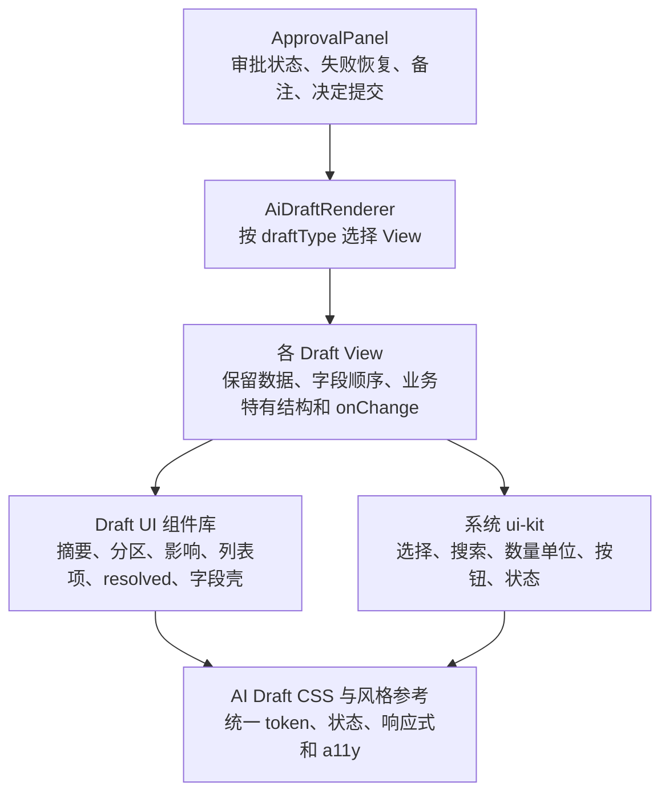

# AI Draft 组件体系与视觉统一设计

日期：2026-07-22

## 1. 背景

AI 审批 Draft 已经覆盖菜谱、做菜、餐单、购物清单、入库、餐食记录、食物资料、食材资料、库存操作和复合操作。所有 `approval_request` 共享同一个审批入口，但具体编辑内容长期集中在 `AiApprovalPanel.tsx` 或少数独立组件中。

当前实现已经有共同的审批卡壳、状态、失败恢复、备注和确认动作，也已有 ui-kit 的下拉、可输入选择、资源搜索、数量单位、状态徽标和表单操作。问题在于：

- 各 Draft 仍重复实现摘要、分区、影响说明、列表项卡和 resolved 状态；
- 同类字段有时绕过 ui-kit 自绘，造成控件高度、键盘行为、选择菜单和无障碍语义不一致；
- `AiApprovalPanel.tsx` 同时承载审批编排、校验、序列化和大量 JSX，新增 Draft 容易继续复制实现；
- `09-ai-workspace.css` 中存在多段共享 Draft 样式及覆盖规则，难以保证新旧 Draft 的视觉收敛；
- 项目 UI 风格已定义 AI 草稿、状态、触控和响应式原则，但缺少一份专门面向 Draft 开发的可执行参考。

本次工作基于当前 `main` 开始，所有迁移都应以该版本的真实行为为准。

## 2. 目标

1. 建立 AI Draft 专用组件库，让新 Draft 能优先复用统一的结构与审批语义。
2. 直接复用现有 ui-kit 的基础交互，避免再造 Select、Combobox、资源搜索、数量单位、状态和按钮体系。
3. 允许各 Draft 为真实业务差异自定义 UI；统一的是视觉与交互契约，不是把所有 Draft 强制渲染成同一个模板。
4. 将所有现有审批 Draft 迁移到共同的视觉规则，覆盖 pending、失败恢复、只读 resolved、风险和移动端场景。
5. 将 `AiApprovalPanel` 收敛为审批壳、状态与渲染分发，减少新增 Draft 时需要触碰的重复 JSX 和 CSS。
6. 在 `frontend-ui-style` 中增加专门的 Draft 风格参考，使后续开发能够明确判断何时复用、何时允许自定义和如何验收。

## 3. 非目标

本设计不包含：

- 修改 Draft 数据结构、默认值、字段内容、校验规则、payload、资源查询、审批决定或后端合同；
- 将全部 Draft 改写成 schema/config 驱动的通用动态表单；
- 修改 AI Runner、Orchestrator、Skill、Tool、数据库、API 或 Alembic migration；
- 将非审批流程的 [RecipeDraftDialog] 迁入本体系；它是生成工作区弹窗，不属于 `approval_request` 生命周期；
- 为了“统一”而删除每种 Draft 必需的特殊卡片、层级或交互；
- 以大面积 `!important`、全局裸标签选择器或临时颜色覆盖处理样式差异。

本设计中的“内容和逻辑不变”指现有用户可见字段、初始值、业务含义、校验结果、提交内容、资源绑定和审批语义保持一致。迁移只改变组合方式、结构性视觉、控件复用与 CSS 归属；若发现已有行为缺陷，单独记录，不在本 PR 顺手修改。

## 4. 适用范围

本次纳入以下审批 Draft：

| Draft 类型 | 主要现有形态 |
| --- | --- |
| `recipe` | 菜谱资料、食材与步骤编辑 |
| `recipe_cook` | 做菜结果、餐食/计划关联与完成信息 |
| `meal_plan` | 餐单项与缺料提醒 |
| `shopping_list` | 采购项、数量、状态与操作摘要 |
| `inventory_intake` | 采购关联与直接入库行 |
| `meal_log` | 餐食信息、食物、参与人、照片和评分 |
| `food_profile` | 食物资料与收藏状态 |
| `ingredient_profile` | 食材资料、追踪方式与库存配置 |
| `inventory_operation` | 消耗、销毁等库存操作 |
| `composite_operation` | 多步骤操作、影响和风险预览 |

所有类型均需覆盖其现有 pending 和 resolved 呈现。`ingredient_profile.transition_tracking_mode` 与 `meal_log.update_composition` 等特殊编辑器仍保留为独立业务 View，但使用同一套视觉和字段契约。

## 5. 架构

### 5.1 三层职责



| 层级 | 负责 | 不负责 |
| --- | --- | --- |
| `ApprovalPanel` | 审批状态、展开/收起、失败恢复、备注、批准/拒绝和现有提交编排 | 继续堆放各业务 Draft 的大段 JSX |
| `AiDraftRenderer` | 依据 `draftType` 与现有 action 选择 View，维持当前分发结果 | 建立通用 schema 表单或重写业务校验 |
| 各 Draft View | 当前字段顺序、业务数据、专属结构、现有 onChange 回调 | 重造已有基础控件和公共状态外观 |
| Draft UI 组件库 | Draft 语义的布局、摘要、分区、影响、resolved、字段壳 | 食材、菜谱、库存等业务规则 |
| 系统 ui-kit | 跨业务控件、可访问性、基础交互和触控表现 | AI Draft 的业务摘要或影响文案 |

### 5.2 目录与导入边界

共享 Draft UI 放在现有 AI 业务目录下的新子目录：

```text
frontend/src/components/ai/draft-ui/
  types.ts
  AiDraftRenderer.tsx
  AiDraftSummaryCard.tsx
  AiDraftSection.tsx
  AiDraftImpactNote.tsx
  AiDraftItemCard.tsx
  AiDraftResolvedSummary.tsx
  AiDraftField.tsx
  AiDraftResourceField.tsx
  AiDraftTagInput.tsx
  views/
    ...按 Draft 类型拆分的 View
```

这是对既有 `frontend/src/components/ai/` 的渐进维护，不创建第二套跨业务 ui-kit。每个 View 只接收其当前 Draft、只读状态、资源数据和 `onChange` 等明确 props；不在 View 中新增请求、缓存失效或提交编排。

现有 model、normalizer、validator、序列化和 action 逻辑保留在其当前职责位置。迁移 JSX 时可以把纯展示格式化函数移动到对应 View 附近，但不得改变返回值、校验顺序或 payload 形状。

### 5.3 Draft 组件库

| 组件 | 统一内容 | 可扩展点 |
| --- | --- | --- |
| `AiDraftSummaryCard` | 标题、摘要项、对象数、当前状态和可选提示 | 业务摘要项、图片或专属头部插槽 |
| `AiDraftSection` | 分区标题、说明、间距、可选辅助操作 | 任意 children 和局部布局 |
| `AiDraftImpactNote` | “确认后会/不会做什么”、计划/提醒/危险语义 | 文案、图标、tone、附加说明 |
| `AiDraftItemCard` | 重复项的标题、摘要、状态、主体与尾部区域 | 任意业务字段、展开行为、媒体或危险块 |
| `AiDraftResolvedSummary` | approved/rejected/expired/cancelled 的压缩结果卡 | 类型专属结果摘要 |
| `AiDraftField` | 可见标签、帮助、错误和控件的垂直关系 | 控件 children、网格归属、required 表达 |
| `AiDraftResourceField` | Draft 内资源选择的触发、已选摘要和资源搜索呈现 | 资源类型、查询/分页回调、图片/描述渲染 |
| `AiDraftTagInput` | 可添加、去重、删除和可访问标签编辑 | 预设标签、领域校验和提示文本 |

组件只提供稳定的结构、语义和视觉角色。它们不要求每个 Draft 都使用；业务特有的视觉可以直接在对应 View 中实现，只要满足本设计第 8 节的风格契约。

### 5.4 ui-kit 复用决策

不新增 `AiDraftSelect`、`AiDraftButton` 等 ui-kit 的平行封装。Draft View 按下表选择：

| 场景 | 首选实现 | Draft 层是否补充 |
| --- | --- | --- |
| 有限单选 | `DropdownSelect` | 仅用 `AiDraftField` 提供标签、帮助、错误与布局 |
| 可输入且可选预设 | `ComboboxField` | 同上 |
| 资源搜索、分页和候选列表 | `SearchableResourceSelect` | `AiDraftResourceField` 统一触发器、已选摘要和弹出语义 |
| 数量与单位 | `QuantityUnitField` | 仅保留业务特有数量禁用原因、单位来源和校验 |
| 有限多选 | `OptionChipGroup` 或现有 ui-kit 能力 | 自定义排布仅限业务确有需要时 |
| 主次表单操作 | `FormActions` 或现有审批动作壳 | 审批拒绝/确认的既有编排不改变 |
| 状态、加载、空/错误 | `StatusBadge`、`StateBlock` | Draft 只决定业务文案与 tone |

如果 ui-kit 已能满足交互需求，Draft 不得为视觉便利而重复实现。若业务结构确有特殊性，可以自定义 UI，但应优先组合现有 ui-kit，而不是重写与它等价的控件行为。

## 6. 视觉与交互契约

### 6.1 共同状态

每个审批 Draft 必须以真实状态呈现：

| 状态 | 必须表达 |
| --- | --- |
| pending | 对象、变更摘要、必要风险、可编辑内容、确认动作 |
| submitting / busy | 明确处理中、禁止重复提交、保留当前内容 |
| validation error | 就近错误信息、原草稿和恢复操作仍可用 |
| execution failure / stale | 当前值、失败原因、恢复提示和可继续编辑的路径 |
| approved / rejected / expired / cancelled | 降低操作强度的压缩结果摘要，不展示可误解为仍可提交的禁用长表单 |
| dangerous operation | 对象、影响范围和不可逆后果；不能只用红色表达 |

pending 的草稿/计划状态使用 `plan` 语义，等待补充或风险使用 `warning`，危险操作使用 `danger`，已批准结果使用 `success`，取消/拒绝/失效使用 `neutral` 或语义明确的 `danger`。任何状态都不能只靠颜色区分。

### 6.2 尺寸、层级和响应式

组件和自定义 UI 都必须使用 `frontend-ui-style` 的 canonical token：

- 普通桌面按钮、输入和选择控件为 `44px`；手机、平板和粗指针高频控件为 `48px`；独立操作热区不小于 `44px × 44px`；
- 卡片、分区、状态面使用现有 `--radius-*`、`--space-*`、`--surface-*`、`--line-*`、`--shadow-*` token；不从遗留 Draft 的硬编码数值反推规范；
- 每张 Draft 卡只保留一个最强主 CTA；确认是 primary，修改/拒绝/取消保持次级层级；
- 手机端不把桌面网格压缩成不可触达的小控件。复杂列表可以改为纵向结构，数据和回调保持一致；
- 长文本、长对象名、资源图片、展开项、底部操作、软键盘和安全区必须成立；
- 控件具备真实 label、focus-visible、合适的 `aria-*` 状态与键盘关闭路径。

### 6.3 自定义 UI 的边界

自定义 UI 被允许并受以下约束：

1. 它服务于当前 Draft 独有的业务结构，例如菜谱步骤、库存批次、复合操作依赖或入库行展开。
2. 它使用同一 token、状态色、控制高度、焦点与触控规则。
3. 它使用 `.ai-draft-<type>-*` 或当前明确的业务前缀，不能新增跨业务泛选择器。
4. 它不复刻已有 ui-kit 的下拉、搜索、数量单位、状态或按钮逻辑。
5. 它在 pending、readonly、busy、error 和手机端有完整表现。

## 7. 样式与参考文档

### 7.1 CSS 归属

新增 Draft 专属样式层，例如 `frontend/src/styles/09-ai-draft-ui.css`，并从 `styles.css` 按既有聚合顺序导入。该文件仅定义跨 Draft 的 `.ai-draft-*` 结构和可复用变体。

迁移时：

- 将 `09-ai-workspace.css` 中真正跨 Draft 的审批卡、字段、摘要和状态重复规则迁入新层或替换为 ui-kit；
- 保留 AI 对话、composer、消息流等非 Draft 样式在 `09-ai-workspace.css`；
- 各类型真正独有的样式保持在具有明确前缀的业务块中；
- 删除被迁移规则和无效覆盖，不以更高选择器权重或 `!important` 叠加新版本；
- 相关新增样式不得增加 style-token drift 报告的无解释命中。当前基线的 53 个报告型命中单独记录，不视为本 PR 自动通过的视觉验收。

### 7.2 风格参考

新增：

```text
.agents/skills/frontend-ui-style/references/ai-draft-patterns.md
```

并更新 `.agents/skills/frontend-ui-style/SKILL.md` 的按需读取路由，使 AI Draft、审批 Draft、审批卡、Draft 组件或 Draft CSS 任务必须读取此 reference。

该 reference 必须包含：

1. 适用范围与非目标，明确它不覆盖 `RecipeDraftDialog`；
2. “先 ui-kit、再 Draft 组件、最后允许自定义 UI”的决策表；
3. pending、busy、validation error、execution failure、resolved、danger 的内容与视觉角色；
4. 摘要、分区、影响提示、列表项、字段和结果摘要的使用准则；
5. token、状态 tone、主次 CTA、中文文案与禁止模式；
6. 桌面、平板、手机、键盘、安全区、滚动和无障碍要求；
7. 自定义 UI 的准入条件、CSS 前缀和验收清单；
8. 新 Draft 开发时必须确认的测试与真实视口检查。

## 8. 各 Draft 的迁移方式

| 类型 | 迁移重点 | 保留的自定义空间 |
| --- | --- | --- |
| `recipe` | 菜谱摘要、食材项、步骤分区、影响说明和结果摘要 | 食材/步骤编辑结构、菜谱图片和排序交互 |
| `recipe_cook` | 做菜结果摘要、计划/餐食关联、状态与结果卡 | 具体做菜完成信息与关联展示 |
| `meal_plan` | 餐单摘要、日期/餐别字段、餐单项和缺料影响 | 计划项、缺料列表和关联资源表达 |
| `shopping_list` | 清单摘要、采购项卡、数量/状态/影响和结果摘要 | 创建、更新、完成、删除等业务差异 |
| `inventory_intake` | 入库总览、来源分区、行卡、注意项和确认影响 | 采购关联、直接入库、包装换算和行展开 |
| `meal_log` | 餐食摘要、分区、资源字段、评分与结果摘要 | 食物项、参与人、照片和评分交互 |
| `food_profile` | 档案摘要、核心信息、标签和收藏结果 | 食物类型、场景、来源与业务字段组合 |
| `ingredient_profile` | 档案摘要、追踪方式、库存配置和影响说明 | 单位换算、追踪方式变更和库存特有字段 |
| `inventory_operation` | 操作摘要、对象卡、危险说明和结果摘要 | 批次、消耗、销毁与库存可视化 |
| `composite_operation` | 总览、步骤卡、风险/回滚和结果摘要 | 步骤依赖、工程详情和风险层级 |

迁移按以下顺序组织，以便每一步都可独立验证：

1. 建立组件库、专属 CSS 和风格参考；
2. 提取 `AiDraftRenderer`，保持 `ApprovalPanel` 的审批编排不变；
3. 迁移内容/清单类 View；
4. 迁移档案类 View；
5. 迁移操作类与现有独立编辑器；
6. 统一 resolved 呈现、删除共享 CSS 重复规则并完成跨端验证。

这不是按风险减少范围的分期发布：最终 PR 必须包含全部十类 Draft 的统一化。上述顺序只用于降低实现和审查风险。

## 9. 行为不变量

迁移期间必须保持：

- 每个 Draft 的 `draftType`、action 分支、字段值、默认值和提交 payload 不变；
- 现有校验、失败恢复、readonly、expired、rejected 和 approved 语义不变；
- 资源选择仍使用原有数据、分页、查询、家庭隔离和回调；
- 既有输入不能因为换用 ui-kit 而丢失自定义单位、空值、日期、标签或数量精度；
- 各 Draft 已有的特殊结构不会被通用组件吞没；
- 用户确认前不出现“已写入”或“已完成”等成功暗示；
- 迁移不改变 AI message part、后端 schema、serializer、AI contract 或缓存失效行为。

## 10. 验收与测试

### 10.1 自动化测试

新增或更新的测试应覆盖：

- Draft 组件库的可见内容、slot、tone、只读、错误、键盘和可访问语义；
- 资源、标签、数量单位和选项字段复用 ui-kit 后的用户交互；
- 每类 Draft 的字段编辑、校验、onChange、确认/拒绝、失败恢复和 resolved 内容与迁移前一致；
- `AiApprovalPanel` 的类型分发和审批编排继续正确；
- `aiWorkspaceContracts.test.ts` 继续覆盖 AI message part 与 Draft 合同。

测试应断言用户可见行为和语义，不以大量 class 名断言替代交互验证。

### 10.2 命令与视觉验证

实现完成后至少运行：

```bash
npm run frontend:quality
npm run frontend:build
npm --prefix frontend run check:style-tokens
npm --prefix frontend test -- src/lib/aiWorkspaceContracts.test.ts
npm run frontend:smoke
```

人工验证每个代表性 Draft 的 pending、busy/error、resolved 和危险态，并检查至少：

- 桌面：1440×900；
- 平板：768×1024；
- 手机：390×844；
- 长中文、长对象名、多个可编辑项、展开项、底部动作和软键盘场景。

## 11. 风险与缓解

| 风险 | 缓解 |
| --- | --- |
| 抽象过度，损失业务表达 | 不做 schema renderer；自定义 UI 是受支持路径 |
| ui-kit 替换改变输入语义 | 先写现有行为测试，保留 model/validator/payload，逐个类型迁移 |
| CSS 迁移造成级联回归 | 新样式层只承载共享 Draft 规则，删除旧规则而非叠加覆盖，逐步运行真实视口检查 |
| `AiApprovalPanel` 拆分引入状态回归 | 审批编排和提交逻辑留在原壳，View 只接收显式数据与回调 |
| 十种 Draft 一次迁移难以审查 | 按三类 View 分组提交，保持每个提交可测试、可审阅 |
| 既有入库样式需要与其它 Draft 同步收敛 | 以当前 `main` 为唯一基线，入库与其它类型一起按新规范重构 |

## 12. 完成定义

以下条件全部满足时，本设计视为完成：

1. 十类审批 Draft 均在新视觉契约下呈现，并保留现有业务行为。
2. 新 Draft 能明确选择 ui-kit、Draft 组件或受控自定义 UI，而不是复制旧 JSX/CSS。
3. `AiApprovalPanel` 不再承担各类型的主要视觉 JSX；其职责清晰限于审批壳与分发。
4. Draft 共享 CSS 已从 AI 工作区的重复规则中收敛，且没有新增无解释 token 漂移。
5. `ai-draft-patterns.md` 已接入 `frontend-ui-style` 的读取路由。
6. 自动化测试、构建、样式检查、smoke 和真实多视口审阅均有通过证据。
